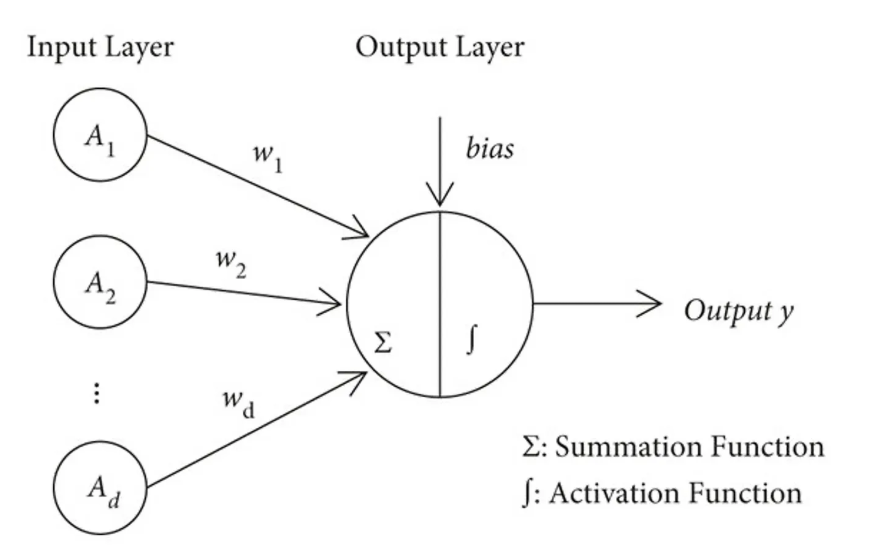

# 1. From perceptron to neural network

## Perceptron
$$
y = 
\begin{cases} 
0 & \text{if } b + w_1 x_1 + w_2 x_2 \leq 0 \\
1 & \text{if } b + w_1 x_1 + w_2 x_2 > 0
\end{cases}
$$
- b : bias
- w : weighted
- activation function & stuffs

### With Only One Perceptron, We can not solve non-linear functions.
### We can Solve that with Multi Layer Perceptron

## 3 Layer Perceptron
### [Code](https://github.com/vscodemania/AI-Learning-Log/main/DeepLearning/tlp.py)
